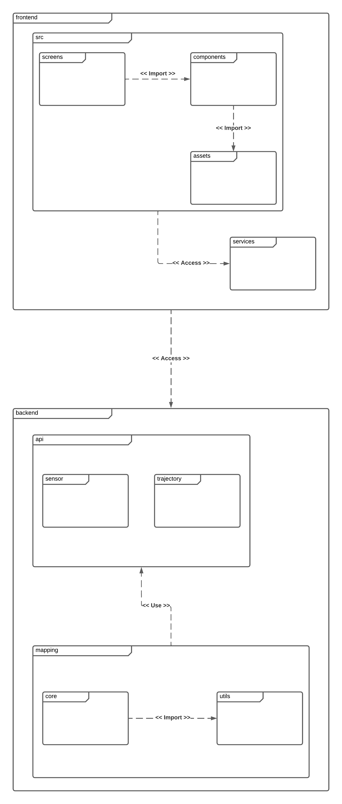
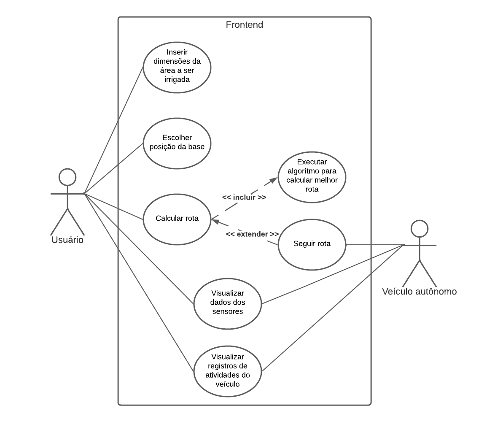
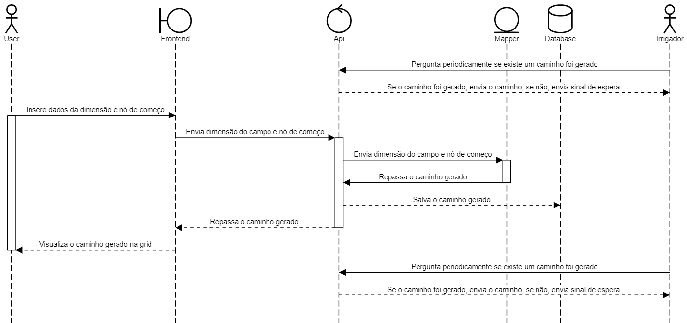
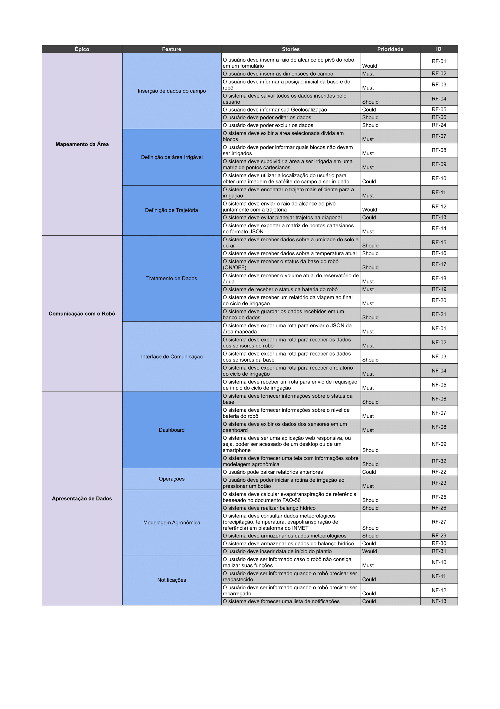

# Documento de Arquitetura de Software

# Introdução
## Proposta

Este documento descreve a arquitetura do sistema de maneira geral, utilizando diferentes visões para dar ênfase em determinados aspectos.

## Escopo

O software do robô de irrigação construído para a matéria de Projeto Integrador 2 (2022.1) tem como objetivos principais:

* Fornecer uma interface gráfica ao usuário, permitindo mapear uma área a ser irrigada, exibir dados dos sensores disponíveis, iniciar ou interromper rotinas de irrigação previamente configuradas

* Fornecer uma interface de comunicação entre o robô e a interface gráfica, utilizando uma API REST para envio e recebimento de dados no formato JSON

* Fornecer um backend onde será realizado o processamento da trajetória do robô a partir de uma área estabelecida pelo usuário

## Definições, Siglas e Acrônimos

* API - Application Programming Interface
* JSON - JavaScript Object Notation
* PaaS - Platform as a Service
* PWA - Progressive Web Application
* REST - Representational State Transfer

# Representação Arquitetural
## Frontend

O frontend da aplicação consiste em um PWA, ou seja, um híbrido entre website e app mobile. Através dele, o usuário pode demarcar a área de interesse a ser irrigada, iniciar ou interromper rotinas de irrigação previamente configuradas e acessar dados dos sensores, como temperatura e umidade. Será implementado em JavaScript com a biblioteca React para facilitar a criação de componentes que podem ser reusados.

## Backend

O backend da aplicação serve como uma ponte entre o frontend e o robô, fornecendo uma API para permitir a comunicação entre as partes e a troca de dados. Além disso, existe um módulo que calcula a trajetória a ser seguida pelo robô na área delimitada.

# Objetivos Arquiteturais e Restrições

São objetivos desta arquitetura:
* Reusabilidade de componentes do frontend
* Simplicidade de endpoints na API
* Permitir flexibilização da troca de informações entre frontend, backend e robô
* Simplicidade de uso para o usuário final

São restrições desta arquitetura:

* A interface de usuário deve estar disponível em navegador web ou mobile
* A rota a ser seguida pelo robô deve ser calculada automaticamente no backend

# Ferramentas Utilizadas

|Nome|Descrição|
|--|--|
|Discod|Ferramenta de comunicação|
|Flask|Framework Python para criação de APIs|
|Git|Controle de versionamento de código-fonte|
|Github|Plataforma de hospedagem de código-fonte|
|Heroku|Plataforma como serviço (PaaS) para deploy do backend|
|React|Biblioteca JavaScript para criação de interface de usuário|
|Telegram|Ferramenta de comunicação|
|Visual Studio Code|Editor de código-fonte|

# Visão Lógica

O frontend da aplicação possui módulos focados em desenvolver as páginas, os componentes compartilhados e trechos de código que podem ser reaproveitados em qualquer ponto. O módulo services é responsável por estabelecer a conexão com o backend da aplicação.

O backend possui a implementação da API, onde são feitas as conexões via REST entre a aplicação e o robô. Além disso, o módulo mappings é responsável por calcular a trajetória que o robô deverá seguir.

## Diagrama de pacotes

## Diagrama de caso de uso

O diagrama de caso de uso apresenta as funcionalidades que os usuários podem realizar no sistema.

Os atores definidos são:

- Usuário: Representa o usuário final do sistema. Não interage diretamente com o veículo, apenas com o frontend.
- Veículo autônomo: Representa o veículo que realiza a ação de irrigar a área determinada pelo usuário.

Os casos de uso definidos são:

- Inserir dimensões da área a ser irrigada: O usuário insere os valores de largura e comprimento da área a ser irrigada.
- Escolher posição da base: A base de operações deve ser posicionada em uma das quatro arestas da área a ser irrigada (considerando que a área é um retângulo definido pelos valores de largura e comprimento fornecidos pelo usuário). A posição da base é determinada pelo usuário.
- Calcular rota: O usuário confirma os valores fornecidos nas etapas anteriores e dá o comando para calcular rota.
- Executar algorítmo para calcular melhor rota: O backend do sistema executa o algorítmo que calcula a melhor rota possível a ser traçada pelo veículo, e envia os pontos para o veículo e para o frontend.
- Seguir rota: Com a rota calculada pelo sistema, o veículo recebe essas informações e segue a rota calculada de maneira autônoma, utilizando seu sistema embarcado e diferentes sensores para realizar a tarefa.
- Visualizar dados dos sensores: O veículo envia periodicamente dados coletados pelos sensores, como temperatura e umidade, e esses dados são exibidos ao usuário através de gráficos.
- Visualizar registros de atividade do veículo: Atividades como sair para irrigar, retornar a base, reabastecer e outras são notificadas pelo veículo e o usuário acessa essas informações em uma tela de relatórios.

## Diagrama de sequencia

## Backlog
O backlog representa a acumulação de trabalho, tudo que deve ser desenvolvido do produto. Consiste em uma pilha de itens a se fazer, solicitados por alguém com base em suas necessidades/desejos e que devem ser entregues a quem solicitou após os artefatos estarem finalizados.

Os épicos levantados para o projeto são:

- Calculo de trajetória: O sistema deve permitir o cálculo da melhor trajetória possível com os dados de largura, comprimento do campo e a posição inicial do robô.
- Tela de Controle: O sistema deve fornecer relatórios dos sensores e exibir um controle com gráficos plotados e dados relacionados a conexão do robô assim como o funcionamento dos seus sensores.
- Tela de Relatórios: O sistema deve fornecer ao usuário uma série de relatórios em forma de gráficos sobre o cálculo hídrico da área em que o robô se encontra.

## MoSCoW

