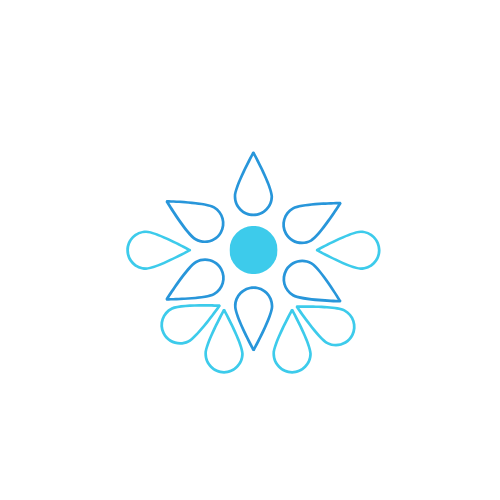

# Identidade Visual
Para trabalhar com uma melhor experiência tanto visual quanto interativa do usuário foi realizado um breve estudo com os membros do grupo para definir qual era a ideia da aplicação na cabeça de cada um.

O resultado dessa pesquisa foi um design de produto voltado para o cliente que fornecesse conforto visual na aplicação.

## 1. Logo
A Logomarca é a principal marca do produto, o selo da aplicação que identifica o produto. 
Para elaborá-la utilizamos os conceitos e atributos do produto para elaborar uma logo mais voltada para o minimalismo e pensando na ideia de irrigação.

## 2. Paleta de cores
Seguindo a proposta de um produto relacionado a água a paleta de cores vem com uma proposta de cores mais pastéis e voltadas para o azul e branco.

A cor primária é a cor #3DCBEB, e a cor secundária #2896DA. Deve-se também utilizar de sombras alternativas destas para garantir um maior contraste e harmonia.

A ferramenta utilizada para construi-la foi [coolors](https://coolors.co/f1be6c-dbe8e1-a0e0e4-e194b5-94e1c0) e a paleta de cores foi utilizada tanto para definir as cores da logo quanto dos componentes da aplicação.
## 3. Tipografia

As fontes utilizadas na aplicação serão:
 - Nunito Sans - para títulos e textos
 - Astron - Utilizada na Logo

Para garantir maior harmonia entre as fontes, todas as escolhidas foram do tipo sans-serif, e foi utilizado o  [Google Fonts](https://fonts.google.com/?selection.family=Nunito|Ubuntu)  para verificar a compatibilidade destas. 

A utilização da família sans-serif também foi feito devido a estas facilitarem a leitura de pessoas com dislexia por não possuírem traços e hastes rebuscadas.

Além disso, estas fontes possuem boa adaptação para aplicações responsivas, como o deste projeto, adaptando-se para visualização web e mobile e também possuem licença que permite uso gratuito.
