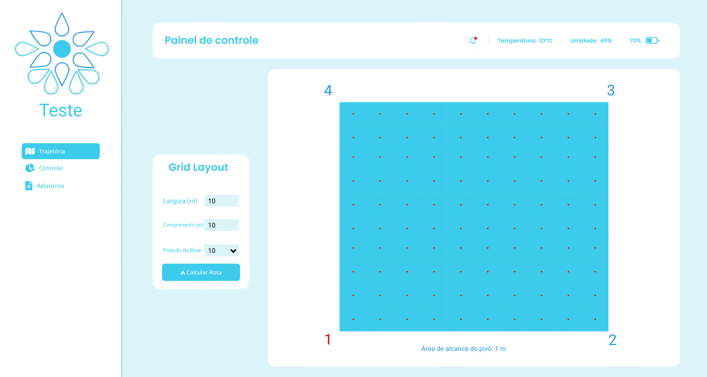
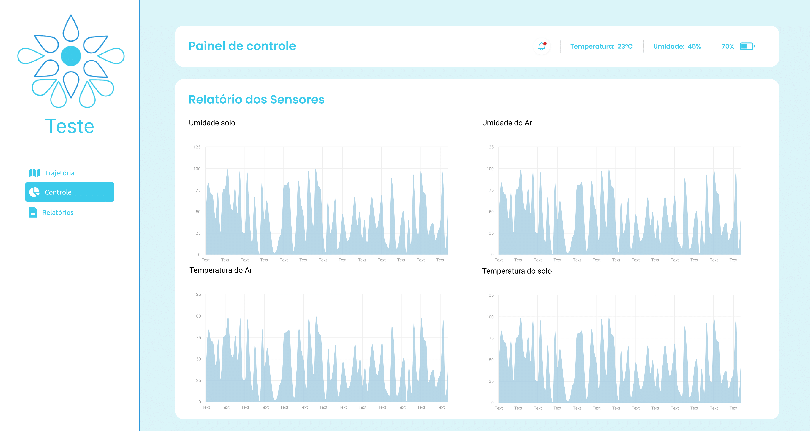
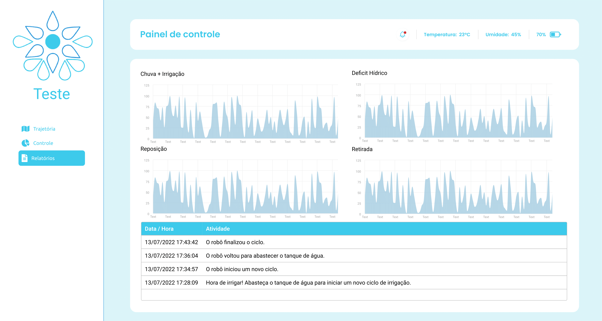

# Prototipagem
## 1. Introdução
Para Sommerville e Sawyer (SOMMERVILLE; SAWYER, 1997), um protótipo pode ser usado como meio de comunicação entre diversos membros da equipe de desenvolvimento ou mesmo como meio de testar ideias. Sendo assim, optamos por usar a prototipação de baixa fidelidade para facilitar o processo de elicitação de requisitos visando obter uma visão real do que deve ser o sistema.

O protótipo de baixa fidelidade foi útil para demonstrar quais atividades o sistema atende e quais as possibilidades de navegação, bem como proporcionar uma visão geral de como o sistema será.

O uso dessa ferramenta também proporcionou a identificação de requisitos funcionais e a validação e alteração dos casos de uso tendo em vista os objetivos gerais e específicos do produto.

## 2. Telas
Um aspecto comum de todas as telas é que elas estão divididas em três principais campos:
 - Barra lateral - Onde será feita a navegação entre as telas de trajetória, controle e relatórios.
 - Barra superior (Painel de controle) - Onde será exibido para o usuário algumas informações gerais relacionadas ao ambiente e ao robô como temperatura atual do local, umidade e uma estimativa da bateria.
 - Conteúdo da página - O principal que diferencia cada tela, exibirá para o usuário as informações relacionadas ao conteúdo da tela selecionada.

### 2.1 Configuração de trajetória
A tela de configuração de trajetória é nossa primeira tela da aplicação. Nela será realizada pelo usuário a configuração do campo que será irrigado com os dados de largura e comprimento do campo, e a posição inicial do robô para que seja calculada a melhor trajetória possível.

### 2.2 Tela de controle
A tela de controles exibirá um painel com gráficos relacionados as respostas recebidas pelos sensores do robô, como umidade do solo, umidade do ar e temperatura, vale ressaltar que diferentemente do painel de controle superior a temperatura e a umidade do relatório dos sensores não é realizada em tempo real, mas sim quando se recebe os dados dos sensores vindos do robô.

### 2.3 Relatórios
A tela de relatórios conta com gráficos relacionados a irrigação, como déficit hídrico ou precipitação, esses dados serão recebidos por meio de uma API e o tratamento dos gráficos feito pelo nosso backend para a plotagem dos gráficos. 

A tela também conta com um registro de atividades do robô, atualizado sempre que o robô retorna a base para o envio dos dados coletados.

